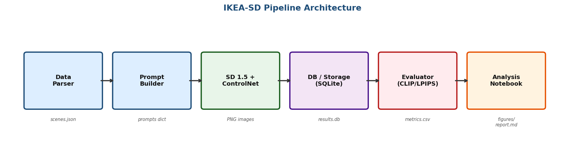
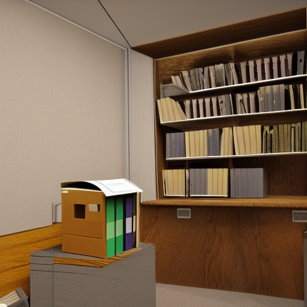
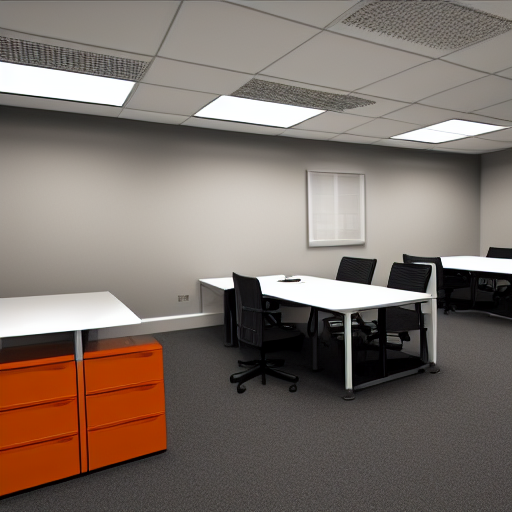
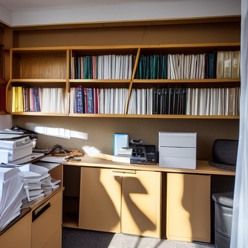

# IKEA-SD: Controlled Interior Design Generation with Stable Diffusion



## Overview

IKEA-SD is a controlled, evaluated image-generation pipeline that converts structured
room metadata from the SUN RGB-D dataset into photorealistic interior design images using
Stable Diffusion 1.5 and ControlNet MLSD conditioning. The project systematically ablates
four prompt strategies (naive → template → enriched → enriched+negative) against two
generation modes (uncontrolled / MLSD-conditioned) across 30 scenes × 3 seeds, producing
720 images evaluated on CLIP alignment, perceptual consistency (LPIPS), diversity, and
aesthetic quality.

---

## Architecture

Six-layer pipeline — each layer is a standalone Python module:

```
SUN RGB-D dataset
      │
      ▼
┌─────────────────┐
│ data_parser.py  │  →  structured_scenes.json
└────────┬────────┘
          │
          ▼
┌─────────────────────┐
│ prompt_builder.py   │  →  4 prompt variants per scene × seed
└────────┬────────────┘
          │
          ├── control=none  →  StableDiffusionPipeline
          │
          └── control=mlsd  →  MLSD preprocessor → StableDiffusionControlNetPipeline
                                                         │
                                               512×512 PNG images
                                                         │
                                                         ▼
                                              ┌──────────────────┐
                                              │   evaluator.py   │  CLIP / LPIPS / diversity / aesthetic
                                              └────────┬─────────┘
                                                       │
                                               results.db  +  metrics.csv
```

See `report/figures/architecture.png` for the rendered diagram.

---

## Dataset

**Source:** [SUN RGB-D — Princeton Vision & Robotics Lab](https://rgbd.cs.princeton.edu)
10,335 annotated indoor RGB-D scenes with 2D/3D bounding boxes and room labels.

**Role:** Used as a structured metadata source only — not for training.

**Fields extracted per scene:**

| Field | Source file | Description |
|-------|------------|-------------|
| `room_type` | `scene.txt` | Coarse room label (office, bathroom, kitchen, …) |
| `objects[]` | `annotation2Dfinal/index.json` | Deduplicated object labels |
| `layout_dims` | `annotation3Dlayout/layout.mat` | Floor-plan bounding box |
| `rgb_relpath` | directory scan | Path to reference RGB image |

**Sample used:** 30 unique scenes, 4 room types (office 82%, bathroom 12%, kitchen 4%, living room 2%), 720 generated images.

---

## Methodology

### Generation Pipeline

- **Base model:** `runwayml/stable-diffusion-v1-5` (fp16)
- **Scheduler:** DPMSolverMultistep, 25 steps, guidance scale 7.5
- **Resolution:** 512 × 512
- **ControlNet:** `lllyasviel/sd-controlnet-mlsd` (straight-line conditioning)
- **VRAM budget:** ~8–9 GB peak on Tesla T4 (attention slicing + VAE slicing)

### 4 Prompt Strategies

| Key | Name | Positive prompt | Negative |
|-----|------|----------------|---------|
| A | Naive | `a {room_type}` | — |
| B | Template | `a photo of a {room_type}, containing {top-5 objects}, realistic interior` | — |
| C | Enriched | Template + style + material + lighting tokens | — |
| D | Enriched+Neg | Same positive as C | Fixed negative (warped perspective, deformed furniture, watermark, …) |

### Control Mechanisms

- **MLSD ControlNet:** extracts dominant straight lines (wall/floor junctions, furniture edges) from a reference room image and conditions the denoising U-Net — stronger spatial coherence than Canny edges.
- **Negative prompts (strategy D):** suppress cartoon artefacts, distortion, watermarks, and people.

The two mechanisms target orthogonal failure modes and are complementary.

---

## Setup

### Prerequisites

1. **Google Drive** — create folder `My Drive/ikea-sd/` with sub-folders `data/raw/`, `data/processed/`, `outputs/`, `report/`.
2. **Hugging Face account** — accept the SD 1.5 license and create a token at <https://huggingface.co/settings/tokens>. Store it as a Colab secret named `HF_TOKEN`.
3. **SUN RGB-D metadata** — see [`data/raw/README.md`](data/raw/README.md) for download instructions.

### Install

```bash
# Local (non-Colab)
python -m venv .venv && source .venv/bin/activate
pip install -r requirements.txt
```

> **Colab note:** `torch`, `torchvision`, `numpy`, and `pandas` are pre-installed on T4 runtimes. The notebooks skip them automatically to avoid ABI conflicts.

---

## How to Reproduce

Run the four notebooks **in order** inside Google Colab (T4 GPU for notebooks 02–03):

| Notebook | Runtime | What it does |
|----------|---------|-------------|
| `notebooks/01_setup_and_parse.ipynb` | CPU | Mount Drive, clone repo, parse SUN RGB-D → `structured_scenes.json` |
| `notebooks/02_generate.ipynb` | T4 GPU | Full factorial experiment → 720 PNG images + `results.db` |
| `notebooks/03_evaluate.ipynb` | T4 GPU | Compute CLIP / LPIPS / diversity / aesthetic → `metrics.csv` |
| `notebooks/04_analysis_report.ipynb` | CPU | Generate all figures → `report/figures/` and write `report/report.md` |

### CLI (local)

```bash
# 1. Parse
python -m src.data_parser --raw-root data/raw \
    --out data/processed/structured_scenes.json --limit 50

# 2. Generate (requires GPU)
python -m src.generator --scenes-json data/processed/structured_scenes.json \
    --config config.yaml --out-dir outputs/generated_images --limit 5

# 3. Evaluate
python -m src.evaluator --db-path outputs/results.db \
    --config config.yaml --out-csv outputs/metrics.csv
```

---

## Sample Outputs

### Best result — Strategy B + MLSD (CLIP 36.25)


### Baseline — Strategy A, no control (CLIP 28.1)


### Enriched+Negative — Strategy D + MLSD (CLIP 32.6)


### Baseline vs Improved — side-by-side (5 scenes)


---

## Results Summary

720 images across 30 scenes × 3 seeds × 4 strategies × 2 control modes.

| Strategy | Control | CLIP Score | LPIPS | Diversity | Aesthetic |
|----------|---------|-----------|-------|-----------|-----------|
| A — Naive | mlsd | 27.23 ± 1.51 | 0.509 ± 0.061 | 0.139 ± 0.042 | 4.96 ± 1.34 |
| A — Naive | none | 27.44 ± 0.65 | 0.626 ± 0.003 | 0.103 ± 0.005 | 5.00 ± 0.83 |
| B — Template | mlsd | **31.24 ± 2.15** | 0.523 ± 0.069 | 0.131 ± 0.041 | 4.90 ± 1.50 |
| B — Template | none | 29.44 ± 2.00 | 0.651 ± 0.046 | 0.133 ± 0.041 | 5.89 ± 1.30 |
| C — Enriched | mlsd | 27.81 ± 2.05 | 0.544 ± 0.077 | 0.126 ± 0.026 | 5.59 ± 1.45 |
| C — Enriched | none | 27.62 ± 2.09 | 0.632 ± 0.036 | 0.130 ± 0.037 | 5.93 ± 1.16 |
| D — Enriched+Neg | mlsd | 27.28 ± 2.47 | 0.543 ± 0.070 | 0.126 ± 0.035 | 5.86 ± 1.30 |
| D — Enriched+Neg | none | 27.45 ± 2.43 | 0.664 ± 0.032 | 0.148 ± 0.041 | 5.86 ± 1.16 |

**Key finding:** Template prompts (B) + MLSD ControlNet achieve the highest CLIP alignment
(31.24, +3.8 pts over naive baseline). MLSD conditioning reduces LPIPS by 17.6% (better
consistency). Over-specified enriched prompts (C/D) exceed CLIP's 77-token window, limiting
their gains on this dataset.


---

## Tools & Libraries

**Models**
- Stable Diffusion 1.5 — `runwayml/stable-diffusion-v1-5`
- MLSD ControlNet — `lllyasviel/sd-controlnet-mlsd`
- CLIP ViT-B-32 — `open_clip_torch`
- LPIPS (AlexNet backbone) — `lpips`
- LAION Aesthetic Predictor (MLP head)

**Frameworks**
- PyTorch 2.2 (fp16, CUDA)
- Hugging Face Diffusers 0.27 + Transformers 4.40
- controlnet-aux 0.0.7
- open_clip_torch 2.24 · torchmetrics 1.3
- scipy 1.13 · h5py 3.11 · pandas 2.2 · matplotlib 3.8 · seaborn 0.13
- SQLite (WAL mode) · python-pptx

**Compute:** Google Colab Pro — Tesla T4 GPU, 15 GB VRAM

---

## AI Tools Disclosure

| Tool | Purpose | Where it shows up |
|------|---------|------------------|
| Claude (Anthropic) | Project blueprint, architecture, code scaffolds, report draft, audit | All `src/*.py`, `report/report.md`, `notebooks/*.ipynb` |
| Claude Code (CLI) | Implementation, figure generation, this README, PPT | `src/*.py`, `notebooks/`, `submission/` |
| Stable Diffusion 1.5 | Image generation | `outputs/generated_images/` |
| MLSD ControlNet | Layout-conditioned generation | Controlled-mode images |
| CLIP / LPIPS / LAION | Automated evaluation | `metrics.csv`, report figures |

All generated content was reviewed, validated, and integrated by the author.
Statistical claims are computed from real experimental data, not generated.

---

## Limitations & Future Work

**Limitations**
- Sample: 30 scenes (from 10,335 available); 82% are "office" — not a balanced interior showcase.
- No fine-tuning: off-the-shelf SD 1.5 + ControlNet weights only (Colab T4 compute budget).
- CLIP evaluation circularity: CLIP shares training distribution with SD; high CLIP ≠ high human preference.
- 512×512 resolution cap; SDXL would improve detail but exceeds T4 VRAM.
- SUN RGB-D labels are noisy; ambiguous room types degrade prompt specificity.
- MLSD requires a reference image; pure text-only generation has no layout anchor.

**Future work**
- LoRA fine-tuning on IKEA product catalog images for brand-specific furniture fidelity.
- Depth-conditioned ControlNet (MiDaS/ZoeDepth) for richer spatial signal.
- IKEA SKU retrieval via CLIP image similarity on generated scenes.
- Human preference evaluation (A/B studies) alongside automatic metrics.
- Scale to all 10,335 SUN RGB-D scenes on multi-GPU infrastructure.

---

## Citations

1. Song, S., Lichtenberg, S. P., & Xiao, J. (2015). SUN RGB-D: A RGB-D scene understanding benchmark suite. *CVPR 2015*.
2. Rombach, R., Blattmann, A., Lorenz, D., Esser, P., & Ommer, B. (2022). High-resolution image synthesis with latent diffusion models. *CVPR 2022*.
3. Zhang, L., Rao, A., & Agrawala, M. (2023). Adding conditional control to text-to-image diffusion models. *ICCV 2023*.
4. Radford, A., et al. (2021). Learning transferable visual models from natural language supervision. *ICML 2021*.
5. Zhang, R., et al. (2018). The unreasonable effectiveness of deep features as a perceptual metric. *CVPR 2018*.

---

## License

MIT — see [LICENSE](LICENSE).
