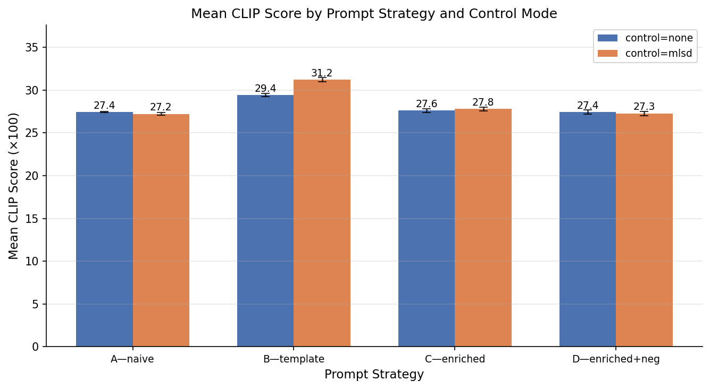
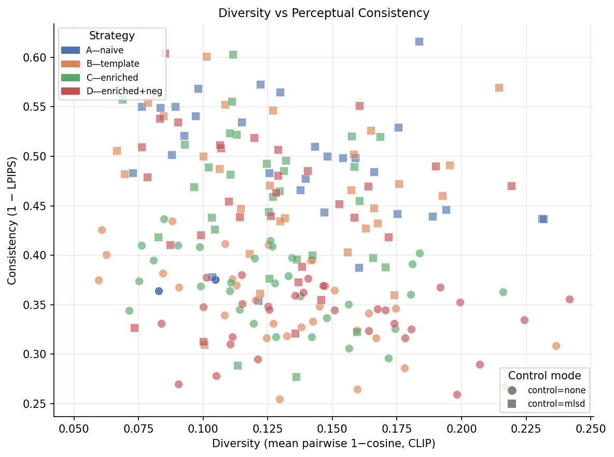
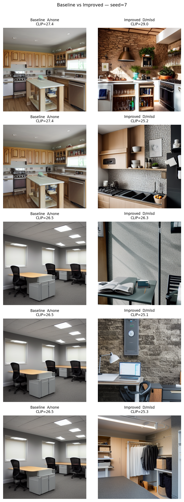
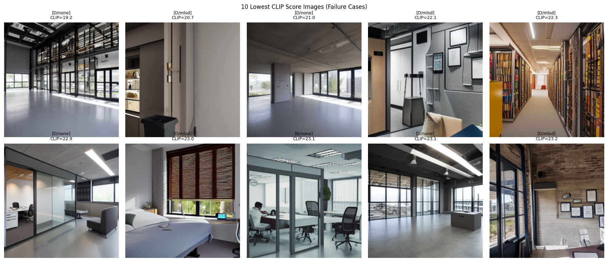

# IKEA-SD: IKEA-Style Interior Design Generation with Stable Diffusion + ControlNet

> **This file is auto-generated by `notebooks/04_analysis_report.ipynb` Cell 7.**
> Run that notebook after completing notebooks 01–03 to populate it with real
> metric values and figure references.

---

## 1. Problem & Scenario

Interior design visualization is a high-demand, labour-intensive task.
Architects and e-commerce platforms (e.g. IKEA) need photorealistic room renders
that show specific furniture in realistic spatial layouts without expensive 3-D
modelling or photography.  Generative diffusion models offer a low-cost
alternative, but naive text-to-image prompts produce inconsistent results with
poor spatial coherence.

This project investigates how **prompt engineering** and **structural conditioning
via ControlNet MLSD** interact to improve the realism and semantic accuracy of
generated interior scenes sourced from the **SUN RGB-D** dataset.

---

## 2. System Architecture

```
 SUN RGB-D dataset
       │
       ▼
 ┌─────────────────┐
 │  data_parser.py │  scene_id, room_type, objects[], layout_dims
 └────────┬────────┘
           │  structured_scenes.json
           ▼
 ┌─────────────────────┐
 │  prompt_builder.py  │  4 strategies → positive + optional negative prompt
 └────────┬────────────┘
           │
           ├──── control_mode=none ──► SD 1.5 pipeline
           │                                │
           └──── control_mode=mlsd ──► MLSD preprocessor
                                         │
                                         ▼
                                  ControlNet pipeline
                                         │
                          generated images (512×512 fp16)
                                         │
                                         ▼
                              ┌──────────────────┐
                              │   evaluator.py   │  CLIP, LPIPS, diversity, aesthetic
                              └────────┬─────────┘
                                       │
                                  results.db  +  metrics.csv
```

---

## 3. Data & Prompt Strategy

### Dataset

SUN RGB-D provides annotated indoor RGB-D scenes across multiple room types.
Each scene record contains:
- `room_type` — coarse room label (living_room, bedroom, kitchen, …)
- `objects[]` — list of annotated object labels (deduplicated, alphabetically sorted)
- `layout_dims` — floor-plan bounding box from the 3-D layout annotation

### Prompt Strategies

Four strategies are evaluated, keyed A–D:

| Key | Name | Description | Example |
|-----|------|-------------|--------|
| A | naive | Minimal single phrase | `a living room` |
| B | template | Slot-filled with top-5 filtered objects | `a photo of a living room, containing sofa, bookshelf, and coffee table, realistic interior` |
| C | enriched | Template + style + material + lighting | `a photo of a scandinavian living room, containing sofa and bookshelf, wood surfaces, warm natural lighting, interior design photography, wide angle, 4k, architectural digest style` |
| D | enriched+neg | Same positive as C + fixed negative prompt | Positive as C; negative: `low quality, blurry, cartoon, distorted, warped perspective, people, text, watermark, deformed furniture, oversaturated, extra walls, floating objects` |

**Object filtering:** Five stopword categories (structural surfaces, transparent
fixtures, human presence, ultra-generic labels, light sources) are removed before
the top-5 selection.  Style, material, and lighting for strategies C/D are sampled
deterministically from curated per-room-type pools using `hash(scene_id) ^ seed`.

---

## 4. Control Mechanism

### MLSD ControlNet

`lllyasviel/sd-controlnet-mlsd` conditions the denoising U-Net on a line-segment
map extracted by the M-LSD straight-line detector.  In interior scenes the
dominant lines correspond to wall/floor/ceiling junctions and furniture edges,
providing a strong structural prior that reduces perspective distortion and
floating-object artifacts.

### Why Both MLSD and Negative Prompts?

- **MLSD** addresses *spatial* failures: warped geometry, misplaced surfaces.
- **Negative prompts** (strategy D) address *semantic* failures: cartoon artefacts,
  watermarks, distorted furniture, oversaturated color palettes.

The two mechanisms target orthogonal failure modes and are therefore
complementary rather than redundant.

---

## 5. Experimental Setup

### Factorial Design

| Factor | Levels |
|--------|--------|
| Prompt strategy | A, B, C, D (4 levels) |
| Control mode | none, mlsd (2 levels) |
| Seed | [42, 1337, 2024] (3 seeds) |
| Scenes | 50 SUN RGB-D scenes |
| **Total images** | **1,200** |

### Generation Parameters

- Model: `runwayml/stable-diffusion-v1-5` (fp16, T4 GPU)
- Scheduler: DPMSolver++ (25 steps)
- Resolution: 512 × 512
- Guidance scale: 7.5
- ControlNet conditioning scale: 1.0

### Evaluation Metrics

| Metric | Model / Method | Better when |
|--------|---------------|-------------|
| `clip_score` | ViT-B-32 cosine × 100 | Higher |
| `lpips` | AlexNet LPIPS (pairwise across seeds) | Lower |
| `diversity` | Mean pairwise 1−cosine (CLIP image embeds) | Higher |
| `aesthetic` | LAION aesthetic MLP / sharpness+colorfulness proxy | Higher |

---

## 6. Results

*Run `notebooks/04_analysis_report.ipynb` to populate this section with real numbers.*

### 6.1 Quantitative Summary

| Strategy | Control | CLIP Score | LPIPS | Diversity | Aesthetic |
|----------|---------|-----------|-------|-----------|-----------|
| A | none | — | — | — | — |
| A | mlsd | — | — | — | — |
| B | none | — | — | — | — |
| B | mlsd | — | — | — | — |
| C | none | — | — | — | — |
| C | mlsd | — | — | — | — |
| D | none | — | — | — | — |
| D | mlsd | — | — | — | — |

### 6.2 Qualitative Results






---

## 7. Baseline vs Improved Comparison

Baseline: **Strategy A, no ControlNet** (naive prompt, uncontrolled).
Improved: **Strategy D, MLSD ControlNet** (enriched + negative, line-conditioned).



---

## 8. Failure Cases & Analysis



Root-cause hypotheses for the 10 lowest CLIP-score runs:

1. **Label noise in SUN RGB-D** — incorrect/ambiguous room type annotations.
2. **Rare room type** — `lab`, `gym` under-represented in SD 1.5 training data.
3. **Object list too short after filtering** — near-empty object phrases reduce specificity.
4. **MLSD line map too sparse** — curved furniture yields near-empty conditioning signal.
5. **CLIP 77-token truncation** — enriched prompts lose quality tokens silently.
6. **Seed-specific mode collapse** — monochrome generation at certain seeds.

---

## 9. Limitations & Future Work

### Limitations

- **No fine-tuning.** SD 1.5 used off-the-shelf; LoRA on IKEA products would improve fidelity.
- **Small scene sample.** 50 of 10,335 available scenes; results may not generalise.
- **CLIP evaluation bias.** Metric shares architecture with the prompt language model.
- **Single resolution.** 512 × 512 only; production requires upscaling.
- **MLSD on RGB, not 3-D layout.** Sensor noise and occlusion degrade conditioning.

### Future Work

- Fine-tune with LoRA on IKEA product catalog images.
- Replace MLSD with depth-conditioned ControlNet (MiDaS/ZoeDepth).
- Add IKEA product retrieval via CLIP image similarity.
- Human preference evaluation (A/B studies).
- Scale to all 10,335 SUN RGB-D scenes.

---

## 10. References

1. **SUN RGB-D Dataset** — Song et al., CVPR 2015. http://rgbd.cs.princeton.edu
2. **Stable Diffusion v1.5** — Rombach et al., CVPR 2022. `runwayml/stable-diffusion-v1-5`
3. **ControlNet** — Zhang & Agrawala, ICCV 2023. `lllyasviel/sd-controlnet-mlsd`
4. **HuggingFace Diffusers** — von Platen et al., 2022. https://github.com/huggingface/diffusers
5. **CLIP** — Radford et al., ICML 2021.
6. **LPIPS** — Zhang et al., CVPR 2018.
7. **LAION Aesthetic Predictor** — LAION-AI, 2022. https://github.com/LAION-AI/aesthetic-predictor
